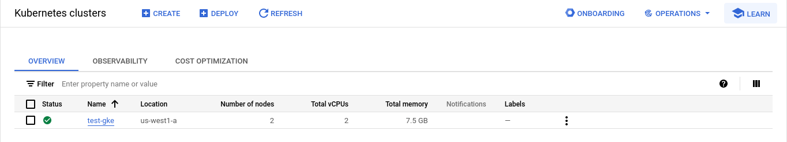

# Setup using gcloud

## Setup your GCP project

* Update your configurations

  ```
  # Creating custom config
  $ gcloud config configurations create test-gke

  # List configurations
  $ gcloud config configurations list

  # Setup the active configuration
  $ gcloud init

  # Check your current config project
  $ gcloud config get project
  Your active configuration is: [test-gke]
  test-gke-419405
  ```

---

## Create a GKE cluster

* Install kubectl  
  gcloud is modular, different components let you control different tools in the Cloud SDK.  
  To work on K8s cluster, installing kubectl is required

  Check if the kubectl component is installed:

  ```
  $ gcloud components list | grep kubectl
  ````

  If not, install it:

  ```
  # Upgrade gcloud and its components (optional)
  gcloud components update

  # Install kubectl
  gcloud components install kubectl
  ```

* Create a Kubernetes cluster  
  [The GKE free tier](https://cloud.google.com/kubernetes-engine/pricing#cluster_management_fee_and_free_tier) provides $74.40 in monthly credits per billing account that are applied to zonal and Autopilot clusters.

  ```
  $ gcloud container clusters create test-gke --machine-type n1-standard-1 --num-nodes 2 --zone us-west1-a
  Default change: VPC-native is the default mode during cluster creation for versions greater than 1.21.0-gke.1500. To create advanced routes based clusters, please pass the `--no-enable-ip-alias` flag
  Note: Your Pod address range (`--cluster-ipv4-cidr`) can accommodate at most 1008 node(s).
  Creating cluster test-gke in us-west1-a... Cluster is being health-checked (master is healthy)...done.                                                                                                                                       
  Created [https://container.googleapis.com/v1/projects/test-gke-419405/zones/us-west1-a/clusters/test-gke].
  To inspect the contents of your cluster, go to: https://console.cloud.google.com/kubernetes/workload_/gcloud/us-west1-a/test-gke?project=test-gke-419405
  kubeconfig entry generated for test-gke.
  NAME      LOCATION    MASTER_VERSION      MASTER_IP      MACHINE_TYPE   NODE_VERSION        NUM_NODES  STATUS
  test-gke  us-west1-a  1.27.8-gke.1067004  35.185.252.65  n1-standard-1  1.27.8-gke.1067004  2          RUNNING
  ```

  Will take a couple of minutes.  
  Note that this will update your .kube/config file

## Checkout out your cluster

* Via the [Google cloud console](https://console.cloud.google.com/kubernetes/list/overview)

  

## Connect to the Kubernetes cluster

* Via the Google cloud shell:

  ``` bash
  # View the current context
  $ kubectl config current-context
  gke_test-gke-419405_us-west1-a_test-gke

  # Lists known contexts
  $ kubectl config view
  apiVersion: v1
  clusters:
  - cluster:
      certificate-authority-data: DATA+OMITTED
      server: https://35.185.252.65
    name: gke_test-gke-419405_us-west1-a_test-gke
  contexts:
  - context:
      cluster: gke_test-gke-419405_us-west1-a_test-gke
      user: gke_test-gke-419405_us-west1-a_test-gke
    name: gke_test-gke-419405_us-west1-a_test-gke
  current-context: gke_test-gke-419405_us-west1-a_test-gke
  kind: Config
  preferences: {}
  users:
  - name: gke_test-gke-419405_us-west1-a_test-gke
    user:
      exec:
        apiVersion: client.authentication.k8s.io/v1beta1
        args: null
        command: gke-gcloud-auth-plugin
        env: null
        installHint: Install gke-gcloud-auth-plugin for use with kubectl by following
          https://cloud.google.com/kubernetes-engine/docs/how-to/cluster-access-for-kubectl#install_plugin
        interactiveMode: IfAvailable
        provideClusterInfo: true

  # List nodes
  $ kubectl get nodes -o wide
  NAME                                      STATUS   ROLES    AGE   VERSION               INTERNAL-IP   EXTERNAL-IP       OS-IMAGE                             KERNEL-VERSION   CONTAINER-RUNTIME
  gke-test-gke-default-pool-6d5075bc-3p8p   Ready    <none>   17m   v1.27.8-gke.1067004   10.138.0.3    34.168.113.118    Container-Optimized OS from Google   5.15.133+        containerd://1.7.10
  gke-test-gke-default-pool-6d5075bc-cthd   Ready    <none>   17m   v1.27.8-gke.1067004   10.138.0.4    104.196.239.110   Container-Optimized OS from Google   5.15.133+        containerd://1.7.10
  ```

* If you need to regenerate your .kube/config credentials:

  ``` bash
  $ gcloud container clusters get-credentials test-gke --zone us-west1-a
  Fetching cluster endpoint and auth data.
  kubeconfig entry generated for test-gke.
  ```

---

## Set up a Docker registry

* Go to [your dashboard](https://console.cloud.google.com/home/dashboard) and retrieve the project ID and project number, displayed on the project Dashboard Project info card:

  

  ``` bash
  PROJECT_NUMBER=353914959645
  PROJECT_ID=test-gke-419405
  REGION=us-west1
  REPO_NAME=test-gke-repo
  ```

* Create a repository:

  ``` bash
  $ gcloud artifacts repositories create $REPO_NAME \
   --repository-format=docker \
   --location=$REGION \
   --description="Docker repository"

  Waiting for operation [projects/test-gke-419405/locations/us-west1/operations/6a6b2831-060a-4ef8-b1c2-cbbed3e91b3f] to complete...done.                                                                                                      
  Created repository [test-gke-repo]
  ```

  Check your [artifact registry](https://console.cloud.google.com/artifacts)

* Add IAM policy bindings to the default compute service account — service account used by GKE by defualt.  
  This is tp grant permissions to the account that interacts with the repository (allow to read).

  ``` bash
  $ gcloud artifacts repositories add-iam-policy-binding $REPO_NAME \
      --location=$REGION \
      --member=serviceAccount:$PROJECT_NUMBER-compute@developer.gserviceaccount.com \
      --role="roles/artifactregistry.reader"
  Updated IAM policy for repository [test-gke-repo].
  bindings:
  - members:
    - serviceAccount:353914959645-compute@developer.gserviceaccount.com
    role: roles/artifactregistry.reader
  etag: BwYVUusGbwI=
  version: 1
  ```

## Authenticate Docker to the artifact registry

``` bash
$ gcloud auth configure-docker $REGION-docker.pkg.dev
Adding credentials for: us-west1-docker.pkg.dev
After update, the following will be written to your Docker config file located at [/home/aurelie/.docker/config.json]:
 {
  "credHelpers": {
    "us-west1-docker.pkg.dev": "gcloud"
  }
}

Do you want to continue (Y/n)?  

Docker configuration file updated.
```

## List images in GCP

* List artifacts [via the Google console](https://console.cloud.google.com/artifacts)

* Via the Google shell:

  ``` bash
  # us-west1-docker.pkg.dev/test-gke-419405/test-gke-repo
  $ DOCKER_REPOSITORY=${REGION}-docker.pkg.dev/${PROJECT_ID}/${REPO_NAME}

  $ gcloud artifacts docker images list $DOCKER_REPOSITORY --format="flattened(package)"
  Listing items under project test-gke-419405, location us-west1, repository test-gke-repo.

  ---
  image: us-west1-docker.pkg.dev/test-gke-419405/test-gke-repo/flask
  ```

## Push an image to the registry

* Build the image

  ``` bash
  $ docker-compose -f docker-compose.full.yml build
  ```

* Tag the image & push it to the registry

  ``` bash
  $ docker tag gcp-gke-flask-web-full:latest ${REGION}-docker.pkg.dev/${PROJECT_ID}/${REPO_NAME}/flask:v1
  $ docker push !$
  ```

---

## Create a K8s deployment

* Create a deployment

  ``` bash
  $ IMAGE=us-west1-docker.pkg.dev/test-gke-419405/test-gke-repo/flask:v1

  $ kubectl create deployment test-app --image=$IMAGE
  deployment.apps/test-app created

  $ kubectl get pod
  NAME                        READY   STATUS    RESTARTS   AGE
  test-app-54b99f4d75-8mm6w   1/1     Running   0          22s
  ```

* Create a NodePort service

  ``` bash
  $ kubectl expose deploy test-app --name=test-app-service --type=NodePort --port=80 --target-port=8080
  service/test-app-service exposed
  ```

* Check out the allocated nodeport

  ``` bash
  $ kubectl get svc test-app-service
  NAME               TYPE       CLUSTER-IP     EXTERNAL-IP   PORT(S)        AGE
  test-app-service   NodePort   10.11.93.190   <none>        80:31546/TCP   7s

  $ NODEPORT=31546
  ```

* Create a firewall rule to allow TCP traffic on your node port

  ``` bash
  $ gcloud compute firewall-rules create test-node-port --allow tcp:$NODEPORT
  Creating firewall...⠹Created [https://www.googleapis.com/compute/v1/projects/test-gke-419405/global/firewalls/test-node-port].                                                                                                               
  Creating firewall...done.                                                                                                                                                                                                                    
  NAME            NETWORK  DIRECTION  PRIORITY  ALLOW      DENY  DISABLED
  test-node-port  default  INGRESS    1000      tcp:31546        False
  ```

* Get the external IP of the node

  ``` bash
  # Node where the pod is running
  $ kubectl get pods -o wide
  NAME                        READY   STATUS    RESTARTS   AGE     IP           NODE                                      NOMINATED NODE   READINESS GATES
  test-app-54b99f4d75-8mm6w   1/1     Running   0          6m45s   10.116.1.9   gke-test-gke-default-pool-6d5075bc-cthd   <none>           <none>

  $ NODE=gke-test-gke-default-pool-6d5075bc-cthd

  # Infos about the node
  $ kubectl get node $NODE -o wide
  NAME                                      STATUS   ROLES    AGE   VERSION               INTERNAL-IP   EXTERNAL-IP       OS-IMAGE                             KERNEL-VERSION   CONTAINER-RUNTIME
  gke-test-gke-default-pool-6d5075bc-cthd   Ready    <none>   64m   v1.27.8-gke.1067004   10.138.0.4    104.196.239.110   Container-Optimized OS from Google   5.15.133+        containerd://1.7.10

  $ IP=104.196.239.110
  ```

* Try it

  ``` bash
  $ curl $IP:$NODEPORT
  <!DOCTYPE html>
  <html>
  <head>
    <title>Testing python Web app with GKE</title>

    <link type="text/css" rel="stylesheet" href="/static/style.css">
  </head>
  <body>
    <h1>Testing python Web app with GKE</h1>
    <p>
      Datetime: 2024-04-05 06:21:20.188866+00:00
    </p>
  </body>
  </html>
  ```

* Clean up

  ``` bash
  $ gcloud compute firewall-rules delete test-node-port
  $ kubectl delete svc test-app-service
  $ kubectl delete deploy test-app
  ```
